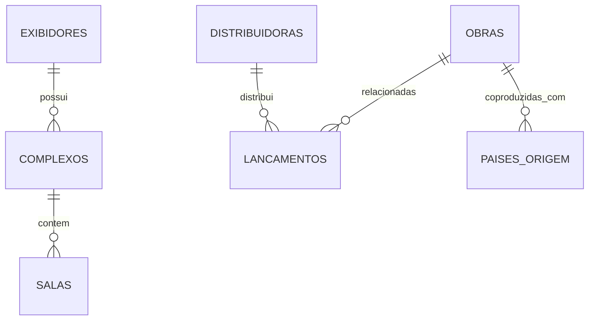

# 🎬 API de Dados Abertos da ANCINE (v1)


**Base URL:** `https://genuine-flight-472304-e1.rj.r.appspot.com/api/v1/`

---

## 🎯 Objetivo do Projeto

A **API de Dados Abertos da ANCINE** tem como objetivo **centralizar, normalizar e facilitar o acesso programático** aos dados públicos disponibilizados pela **Agência Nacional do Cinema (ANCINE)**.  

O projeto foi criado para **transformar conjuntos de dados dispersos** — que antes existiam em planilhas e CSVs — num **ecossistema relacional unificado**, permitindo análises cruzadas entre **produção, distribuição e exibição cinematográfica** no Brasil.

Esta API serve como um **gateway de transparência**, possibilitando que:
- Desenvolvedores criem dashboards e aplicações dinâmicas;
- Analistas de dados explorem padrões do setor audiovisual;
- O público compreenda a dinâmica e impacto econômico do cinema nacional.

---

## 🧭 Origem e Tratamento dos Dados

Os dados consumidos por esta API têm origem nos **datasets públicos oficiais da ANCINE**, disponíveis no [Portal de Dados Abertos do Governo Federal](https://dados.gov.br).  

### Conjuntos de Dados Utilizados

- **Salas de Exibição e Complexos Cinematográficos**
- **Distribuidoras e Exibidores**
- **Lançamentos Comerciais**
- **Obras Brasileiras (Certificados CPB)**
- **Países de Origem de Co-produção**
- **Dados de Filmagem Estrangeira no Brasil**

### Processo de Transformação

Durante o processo de construção, estes ficheiros CSV foram:

1. **Extraídos** diretamente das fontes públicas oficiais;
2. **Padronizados** em encoding UTF-8, nomenclaturas consistentes e tipos de dados apropriados;
3. **Normalizados** em tabelas relacionais (salas, complexos, exibidores, obras, lançamentos, etc.);
4. **Integrados** num modelo unificado que permite consultas aninhadas via API.

A principal transformação é a **resolução da desnormalização dos arquivos CSV originais**. Por exemplo, antes um CSV podia repetir o nome do exibidor em centenas de linhas; agora, ele é representado apenas uma vez na tabela `exibidores`, e referenciado nas `salas` e `complexos` via chave primária.

### Benefícios da Normalização

- **Coerência**: Eliminação de duplicações e inconsistências
- **Consistência referencial**: Relações garantidas entre entidades
- **Performance**: Consultas otimizadas com índices apropriados
- **Auditabilidade**: Rastreabilidade completa das transformações aplicadas

---

## 🧩 Modelo de Dados Conceitual

A API é baseada num **modelo relacional** com seis entidades principais organizadas em três domínios:

### Domínio de Exibição
- **Exibidores**: Empresas que operam salas de cinema
- **Complexos**: Agrupamentos de salas (shopping centers, etc.)
- **Salas**: Unidades individuais de exibição

### Domínio de Produção
- **Obras**: Filmes brasileiros com certificado CPB
- **Países de Origem**: Países envolvidos em co-produções

### Domínio de Distribuição
- **Distribuidoras**: Empresas responsáveis pela distribuição
- **Lançamentos**: Dados de bilheteria e público por filme



### Relações Principais

- Cada **Sala** pertence a um **Complexo**, que é operado por um **Exibidor**
- Cada **Lançamento** está ligado a uma **Distribuidora** e, se for nacional, a uma **Obra Brasileira**
- Cada **Obra** pode ter múltiplos **Países de Origem**, refletindo co-produções internacionais

Por isso é possível usar filtros aninhados como `complexos.uf_complexo` ou `distribuidoras.razao_social_distribuidora`.

---

## 📄 Paginação (Baseada em Cursor)

Todos os endpoints que retornam listas são paginados via cursor, garantindo performance em consultas longas.

| Parâmetro | Tipo | Descrição |
|-----------|------|-----------|
| `limit` | int | Número de itens por página (padrão: 10, máximo: 100) |
| `last_id` | string | Cursor que indica o último item retornado na página anterior |

---

## 🔍 Endpoints de Pesquisa

### 1. Pesquisa de Salas com Relacionamentos

**Endpoint:** `GET /api/v1/pesquisa-salas`

Busca salas de cinema com dados completos dos complexos e exibidores relacionados.

#### Parâmetros de Filtro Suportados

| Campo | Formato do Parâmetro | Exemplo de Valor | Descrição |
|-------|---------------------|------------------|-----------|
| Situação da Sala | `situacao_sala` | `Em Funcionamento` | Situação operacional da sala |
| UF do Complexo | `complexos.uf_complexo` | `SP` | Estado onde o complexo está localizado |
| Município | `complexos.municipio_complexo` | `São Paulo` | Cidade do complexo |
| Nome do Exibidor | `complexos.exibidores.nome_grupo_exibidor` | `CINEMARK` | Grupo empresarial responsável |
| Tipo de Tela | `tipo_tela` | `2D` | Tecnologia de projeção |
| Tipo de Som | `tipo_som` | `DOLBY DIGITAL` | Sistema de áudio |

#### Schema da Resposta

| Campo | Tipo | Descrição | Pode ser Nulo |
|-------|------|-----------|---------------|
| `registro_sala` | string | Identificador único da sala de exibição | Não |
| `nome_sala` | string | Nome oficial da sala | Não |
| `situacao_sala` | string | Situação operacional ("Em Funcionamento", "Fechado", "Em Construção") | Não |
| `tipo_tela` | string | Tecnologia de projeção (2D, 3D, IMAX, etc.) | Sim |
| `tipo_som` | string | Sistema de áudio (DOLBY DIGITAL, DTS, etc.) | Sim |
| `poltronas` | int | Número de assentos disponíveis | Sim |
| `complexos` | object | Dados do complexo cinematográfico | Não |
| `complexos.registro_complexo` | string | Identificador único do complexo | Não |
| `complexos.nome_complexo` | string | Nome do complexo/shopping | Não |
| `complexos.uf_complexo` | string | Unidade federativa (SP, RJ, etc.) | Não |
| `complexos.municipio_complexo` | string | Município onde está localizado | Não |
| `complexos.endereco_complexo` | string | Endereço completo | Sim |
| `complexos.exibidores` | object | Dados do grupo exibidor | Não |
| `complexos.exibidores.registro_exibidor` | string | Identificador único do exibidor | Não |
| `complexos.exibidores.nome_grupo_exibidor` | string | Nome do grupo empresarial | Não |
| `complexos.exibidores.cnpj_exibidor` | string | CNPJ da empresa exibidora | Sim |

#### Exemplo de Uso

**Requisição:**
```bash
curl "https://genuine-flight-472304-e1.rj.r.appspot.com/api/v1/pesquisa-salas?complexos.uf_complexo=SP&limit=2"
```

**Resposta:**
```json
{
  "data": [
    {
      "registro_sala": "SALA001SP",
      "nome_sala": "Sala 1",
      "situacao_sala": "Em Funcionamento",
      "tipo_tela": "2D",
      "tipo_som": "DOLBY DIGITAL",
      "poltronas": 180,
      "complexos": {
        "registro_complexo": "COMP001SP",
        "nome_complexo": "Shopping Ibirapuera",
        "uf_complexo": "SP",
        "municipio_complexo": "São Paulo",
        "endereco_complexo": "Av. Ibirapuera, 3103",
        "exibidores": {
          "registro_exibidor": "EXB001",
          "nome_grupo_exibidor": "CINEMARK",
          "cnpj_exibidor": "12.345.678/0001-90"
        }
      }
    }
  ],
  "pagination": {
    "total_filtered_count": 1250,
    "per_page": 2,
    "next_cursor": "SALA002SP",
    "has_next": true
  }
}
```

### 2. Pesquisa de Obras Brasileiras

**Endpoint:** `GET /api/v1/obras/pesquisa`

Busca obras cinematográficas brasileiras com certificado CPB e países de co-produção.

#### Parâmetros de Filtro Suportados

| Campo | Formato do Parâmetro | Exemplo de Valor | Descrição |
|-------|---------------------|------------------|-----------|
| Tipo de Obra | `tipo_obra` | `Longa-metragem` | Categoria da produção |
| Gênero | `genero` | `Drama` | Gênero cinematográfico |
| Ano de Produção | `ano_producao` | `2023` | Ano de finalização |
| País de Co-produção | `paises_origem.pais` | `França` | País parceiro na produção |
| Situação | `situacao` | `Finalizada` | Status da obra |

#### Schema da Resposta

| Campo | Tipo | Descrição | Pode ser Nulo |
|-------|------|-----------|---------------|
| `cpb` | string | Certificado de Produto Brasileiro (chave primária) | Não |
| `titulo_obra` | string | Título oficial da obra | Não |
| `tipo_obra` | string | Categoria (Longa-metragem, Curta-metragem, etc.) | Não |
| `genero` | string | Gênero cinematográfico principal | Sim |
| `ano_producao` | int | Ano de finalização da produção | Sim |
| `situacao` | string | Status atual da obra | Não |
| `duracao_minutos` | int | Duração em minutos | Sim |
| `sinopse` | string | Resumo da obra | Sim |
| `paises_origem` | array[object] | Lista de países envolvidos na produção | Não |
| `paises_origem[].id` | int | Identificador único da relação | Não |
| `paises_origem[].pais` | string | Nome do país | Não |
| `paises_origem[].tipo_participacao` | string | Tipo de envolvimento (Co-produção, Financiamento, etc.) | Sim |

#### Exemplo de Uso

**Requisição:**
```bash
curl "https://genuine-flight-472304-e1.rj.r.appspot.com/api/v1/obras/pesquisa?tipo_obra=Longa-metragem&limit=1"
```

**Resposta:**
```json
{
  "data": [
    {
      "cpb": "B2023001234",
      "titulo_obra": "O Último Bandeirante",
      "tipo_obra": "Longa-metragem",
      "genero": "Drama",
      "ano_producao": 2023,
      "situacao": "Finalizada",
      "duracao_minutos": 105,
      "sinopse": "Drama histórico sobre...",
      "paises_origem": [
        {
          "id": 1,
          "pais": "Brasil",
          "tipo_participacao": "Produção Principal"
        },
        {
          "id": 2,
          "pais": "França",
          "tipo_participacao": "Co-produção"
        }
      ]
    }
  ],
  "pagination": {
    "total_filtered_count": 450,
    "per_page": 1,
    "next_cursor": "B2023001235",
    "has_next": true
  }
}
```

### 3. Pesquisa de Lançamentos Comerciais

**Endpoint:** `GET /api/v1/lancamentos/pesquisa`

Busca dados de bilheteria com informações das distribuidoras e obras relacionadas.

#### Parâmetros de Filtro Suportados

| Campo | Formato do Parâmetro | Exemplo de Valor | Descrição |
|-------|---------------------|------------------|-----------|
| Razão Social da Distribuidora | `distribuidoras.razao_social_distribuidora` | `DISNEY` | Nome da empresa distribuidora |
| Ano de Lançamento | `ano_lancamento` | `2023` | Ano do lançamento comercial |
| Título do Filme | `titulo_filme` | `Homem-Aranha` | Nome do filme |
| CPB da Obra | `obras.cpb` | `B2023001234` | Certificado da obra brasileira |
| Público Mínimo | `publico_total` | `100000` | Filtro por público total |

#### Schema da Resposta

| Campo | Tipo | Descrição | Pode ser Nulo |
|-------|------|-----------|---------------|
| `id` | int | Identificador único do lançamento | Não |
| `cpb_roe` | string | CPB (brasileiro) ou ROE (estrangeiro) | Não |
| `titulo_filme` | string | Título comercial do filme | Não |
| `data_lancamento` | date | Data do lançamento comercial | Não |
| `ano_lancamento` | int | Ano do lançamento | Não |
| `publico_total` | int | Número total de espectadores | Sim |
| `renda_total` | decimal | Receita total em reais | Sim |
| `distribuidoras` | object | Dados da empresa distribuidora | Não |
| `distribuidoras.registro_distribuidora` | string | Identificador único da distribuidora | Não |
| `distribuidoras.razao_social_distribuidora` | string | Nome empresarial | Não |
| `distribuidoras.cnpj_distribuidora` | string | CNPJ ou "PESSOA FÍSICA" | Sim |
| `obras` | object | Dados da obra brasileira (se aplicável) | Sim |
| `obras.cpb` | string | Certificado de Produto Brasileiro | Sim |
| `obras.titulo_obra` | string | Título oficial da obra | Sim |
| `obras.tipo_obra` | string | Categoria da produção | Sim |

#### Exemplo de Uso

**Requisição:**
```bash
curl "https://genuine-flight-472304-e1.rj.r.appspot.com/api/v1/lancamentos/pesquisa?distribuidoras.razao_social_distribuidora=DISNEY&limit=1"
```

**Resposta:**
```json
{
  "data": [
    {
      "id": 12345,
      "cpb_roe": "E2023005678",
      "titulo_filme": "Guardiões da Galáxia Vol. 3",
      "data_lancamento": "2023-05-04",
      "ano_lancamento": 2023,
      "publico_total": 2500000,
      "renda_total": 45000000.50,
      "distribuidoras": {
        "registro_distribuidora": "DIST001",
        "razao_social_distribuidora": "DISNEY",
        "cnpj_distribuidora": "98.765.432/0001-10"
      },
      "obras": null
    }
  ],
  "pagination": {
    "total_filtered_count": 89,
    "per_page": 1,
    "next_cursor": "12346",
    "has_next": true
  }
}
```

---

## 📊 Endpoints de Estatísticas e KPIs

### 1. Market Share do Cinema Nacional

**Endpoint:** `GET /api/v1/estatisticas/market_share`

Calcula o percentual de público e renda do cinema nacional versus estrangeiro.

#### Metodologia de Cálculo

**Tabelas Utilizadas:** `lancamentos`  
**Coluna de Agrupamento:** Prefixo do campo `cpb_roe` (B = Brasileiro, E = Estrangeiro)  
**Métricas Calculadas:** `SUM(publico_total)`, `SUM(renda_total)`

```sql
SELECT 
  CASE 
    WHEN cpb_roe LIKE 'B%' THEN 'Nacional'
    WHEN cpb_roe LIKE 'E%' THEN 'Estrangeiro'
  END as tipo,
  SUM(publico_total) as publico_total,
  SUM(renda_total) as renda_total,
  ROUND(SUM(publico_total) * 100.0 / (SELECT SUM(publico_total) FROM lancamentos), 2) as percentual_publico,
  ROUND(SUM(renda_total) * 100.0 / (SELECT SUM(renda_total) FROM lancamentos), 2) as percentual_renda
FROM lancamentos
WHERE publico_total IS NOT NULL AND renda_total IS NOT NULL
GROUP BY tipo;
```

#### Exemplo de Resposta

```json
[
  {
    "tipo": "Nacional",
    "publico_total": 15000000,
    "renda_total": 180000000.00,
    "percentual_publico": 12.50,
    "percentual_renda": 8.75
  },
  {
    "tipo": "Estrangeiro",
    "publico_total": 105000000,
    "renda_total": 1870000000.00,
    "percentual_publico": 87.50,
    "percentual_renda": 91.25
  }
]
```

### 2. Ranking de Distribuidoras

**Endpoint:** `GET /api/v1/estatisticas/ranking_distribuidoras`

Lista as distribuidoras com maior bilheteria total.

#### Metodologia de Cálculo

**Tabelas Utilizadas:** `lancamentos` JOIN `distribuidoras`  
**Coluna de Agrupamento:** `distribuidoras.razao_social_distribuidora`  
**Métricas Calculadas:** `SUM(publico_total)`, `SUM(renda_total)`, `COUNT(*) as total_lancamentos`  
**Ordenação:** `renda_total DESC`

```sql
SELECT 
  d.razao_social_distribuidora,
  SUM(l.publico_total) as publico_total,
  SUM(l.renda_total) as renda_total,
  COUNT(*) as total_lancamentos,
  AVG(l.publico_total) as publico_medio_por_filme
FROM lancamentos l
JOIN distribuidoras d ON l.registro_distribuidora = d.registro_distribuidora
WHERE l.publico_total IS NOT NULL AND l.renda_total IS NOT NULL
GROUP BY d.razao_social_distribuidora
ORDER BY renda_total DESC
LIMIT 10;
```

#### Exemplo de Resposta

```json
[
  {
    "razao_social_distribuidora": "DISNEY",
    "publico_total": 45000000,
    "renda_total": 850000000.00,
    "total_lancamentos": 12,
    "publico_medio_por_filme": 3750000
  },
  {
    "razao_social_distribuidora": "UNIVERSAL",
    "publico_total": 38000000,
    "renda_total": 720000000.00,
    "total_lancamentos": 15,
    "publico_medio_por_filme": 2533333
  }
]
```

### 3. Desempenho por Gênero (Cinema Nacional)

**Endpoint:** `GET /api/v1/estatisticas/desempenho_genero_br`

Analisa o público médio por gênero cinematográfico das obras brasileiras.

#### Metodologia de Cálculo

**Tabelas Utilizadas:** `lancamentos` JOIN `obras`  
**Coluna de Agrupamento:** `obras.genero`  
**Filtro:** Apenas lançamentos com `cpb_roe LIKE 'B%'` (filmes brasileiros)  
**Métricas Calculadas:** `AVG(publico_total)`, `AVG(renda_total)`, `COUNT(*) as total_obras`

```sql
SELECT 
  o.genero,
  AVG(l.publico_total) as publico_medio,
  AVG(l.renda_total) as renda_media,
  COUNT(*) as total_obras,
  SUM(l.publico_total) as publico_total_genero
FROM lancamentos l
JOIN obras o ON l.cpb_roe = o.cpb
WHERE l.cpb_roe LIKE 'B%' 
  AND l.publico_total IS NOT NULL 
  AND o.genero IS NOT NULL
GROUP BY o.genero
ORDER BY publico_medio DESC;
```

### 4. Desempenho de Co-produção

**Endpoint:** `GET /api/v1/estatisticas/desempenho_coproducao`

Compara o desempenho entre produções 100% nacionais e co-produções internacionais.

#### Metodologia de Cálculo

**Tabelas Utilizadas:** `lancamentos` JOIN `obras` LEFT JOIN `paises_origem`  
**Coluna de Agrupamento:** Tipo de produção (Nacional vs Co-produção)  
**Critério de Co-produção:** Obras com mais de um país em `paises_origem`  
**Métricas Calculadas:** `AVG(publico_total)`, `COUNT(DISTINCT obras.cpb)`

```sql
SELECT 
  CASE 
    WHEN COUNT(po.pais) > 1 THEN 'Co-produção'
    ELSE 'Nacional'
  END as tipo_producao,
  AVG(l.publico_total) as publico_medio,
  AVG(l.renda_total) as renda_media,
  COUNT(DISTINCT o.cpb) as total_obras
FROM lancamentos l
JOIN obras o ON l.cpb_roe = o.cpb
LEFT JOIN paises_origem po ON o.cpb = po.cpb
WHERE l.cpb_roe LIKE 'B%' AND l.publico_total IS NOT NULL
GROUP BY o.cpb, tipo_producao
ORDER BY publico_medio DESC;
```

### 5. Análise Geográfica - Salas por UF

**Endpoint:** `GET /api/v1/estatisticas/salas_por_uf`

Distribui a infraestrutura de exibição por unidade federativa.

#### Metodologia de Cálculo

**Tabelas Utilizadas:** `salas` JOIN `complexos`  
**Coluna de Agrupamento:** `complexos.uf_complexo`  
**Métricas Calculadas:** `COUNT(*) as total_salas`, `SUM(poltronas) as total_poltronas`

```sql
SELECT 
  c.uf_complexo,
  COUNT(s.registro_sala) as total_salas,
  SUM(s.poltronas) as total_poltronas,
  AVG(s.poltronas) as media_poltronas_por_sala,
  COUNT(DISTINCT c.registro_complexo) as total_complexos
FROM salas s
JOIN complexos c ON s.registro_complexo = c.registro_complexo
WHERE s.situacao_sala = 'Em Funcionamento'
GROUP BY c.uf_complexo
ORDER BY total_salas DESC;
```

### 6. Análise Geográfica - Obras por UF

**Endpoint:** `GET /api/v1/estatisticas/obras_por_uf`

Mapeia a produção cinematográfica brasileira por estado.

#### Metodologia de Cálculo

**Tabelas Utilizadas:** `obras`  
**Coluna de Agrupamento:** `uf_producao`  
**Métricas Calculadas:** `COUNT(*) as total_obras`, agrupamento por `tipo_obra`

```sql
SELECT 
  uf_producao,
  tipo_obra,
  COUNT(*) as total_obras,
  AVG(duracao_minutos) as duracao_media
FROM obras
WHERE uf_producao IS NOT NULL
GROUP BY uf_producao, tipo_obra
ORDER BY uf_producao, total_obras DESC;
```

---

## 🔑 Chaves Primárias para Paginação

| Tabela / Endpoint | Chave (`last_id`) | Tipo |
|-------------------|-------------------|------|
| `salas` / `pesquisa-salas` | `registro_sala` | string |
| `complexos` | `registro_complexo` | string |
| `exibidores` | `registro_exibidor` | string |
| `obras` / `obras/pesquisa` | `cpb` | string |
| `distribuidoras` | `registro_distribuidora` | string |
| `lancamentos` / `lancamentos/pesquisa` | `id` | int |
| `paises_origem` | `id` | int |

---

## ⚠️ Notas e Peculiaridades sobre os Dados

### Limitações Conhecidas

1. **CNPJ de Distribuidoras**: O campo `cnpj_distribuidora` pode conter o valor "PESSOA FÍSICA", não sendo único para identificação.

2. **Obras Estrangeiras**: Lançamentos de filmes estrangeiros não possuem objeto `obras` associado (retorna `null`), pois não possuem certificado CPB.

3. **Campos Nulos**: Valores `null` indicam ausência de informação pública nos dados originais, não erro técnico da API.

4. **Atualização dos Dados**: Os dados refletem o estado mais recente publicado pela ANCINE e podem conter atrasos de atualização em relação aos dados oficiais.

5. **Encoding**: Todos os textos estão em UTF-8. Caracteres especiais e acentos são preservados conforme os dados originais.

### Interpretação de Códigos

- **CPB**: Certificado de Produto Brasileiro (filmes nacionais)
- **ROE**: Registro de Obra Estrangeira (filmes importados)
- **Situação da Sala**: "Em Funcionamento", "Fechado", "Em Construção", "Reformando"

---

## 🚀 Exemplos de Uso Avançado

### Consulta Complexa: Salas IMAX em São Paulo

```bash
curl "https://genuine-flight-472304-e1.rj.r.appspot.com/api/v1/pesquisa-salas?complexos.uf_complexo=SP&tipo_tela=IMAX&limit=5"
```

### Análise de Co-produções com França

```bash
curl "https://genuine-flight-472304-e1.rj.r.appspot.com/api/v1/obras/pesquisa?paises_origem.pais=França&limit=10"
```

### Lançamentos da Disney em 2023

```bash
curl "https://genuine-flight-472304-e1.rj.r.appspot.com/api/v1/lancamentos/pesquisa?distribuidoras.razao_social_distribuidora=DISNEY&ano_lancamento=2023"
```

---

## 📜 Licença

Distribuído sob a licença MIT.

Contribuições são bem-vindas para expandir endpoints, corrigir mapeamentos e aprimorar descrições.

Desenvolvido com ❤️ e compromisso com a transparência de dados públicos.

**Agência Nacional do Cinema – ANCINE**

*Versão 1.0 • 2025*